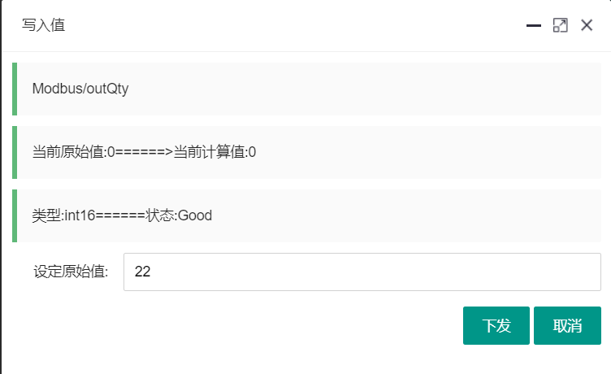
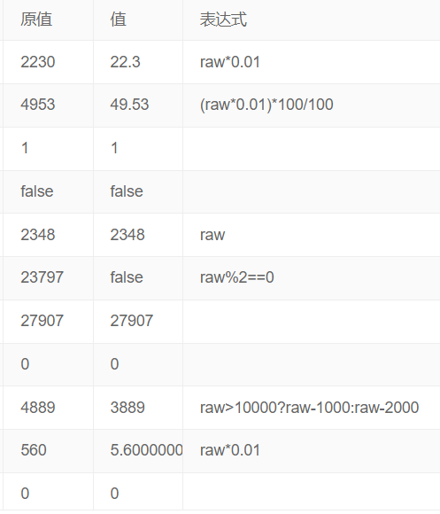
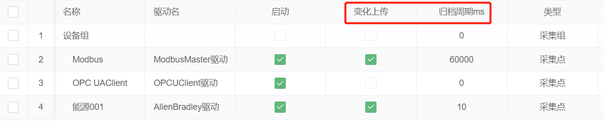
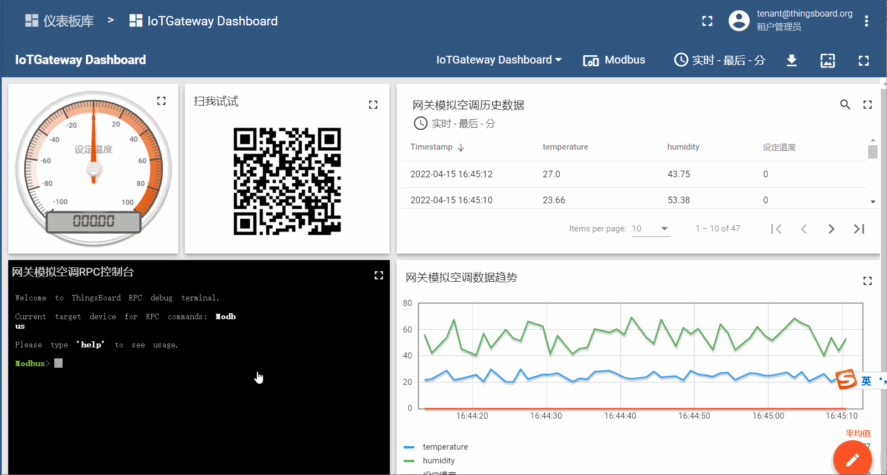
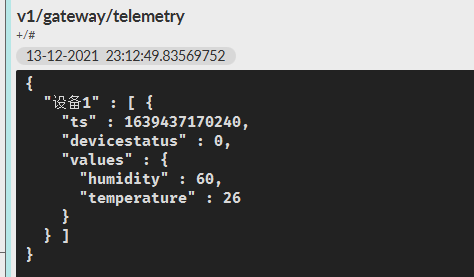
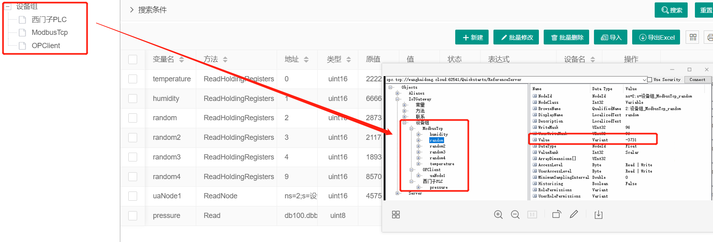
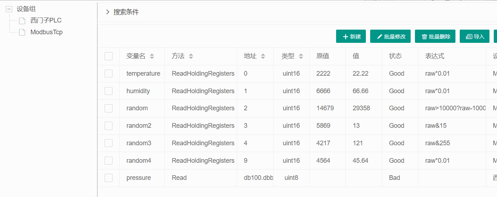
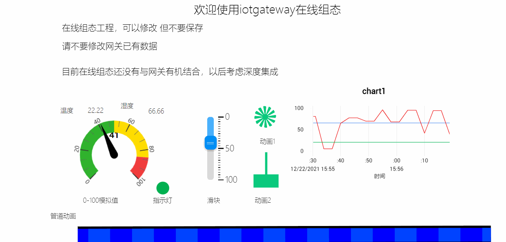
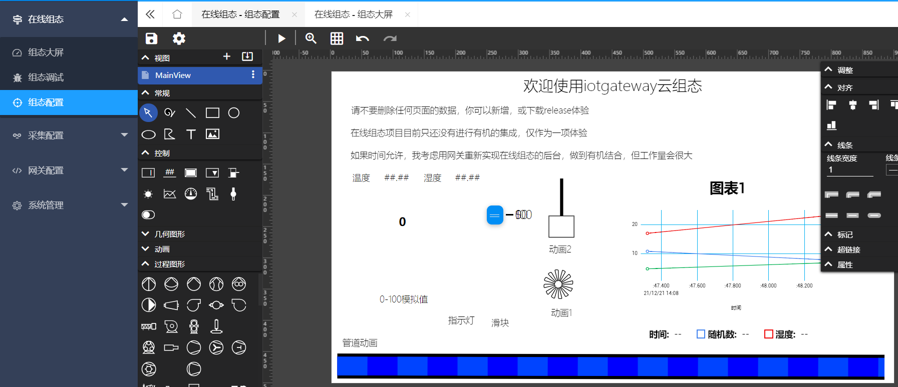

# IoTGateway

## [Live Demo http://online.iotgateway.net](http://online.iotgateway.net/)

- Username: `admin`     Password: `iotgateway.net`

> Cross-platform industrial IoT gateway based on .NET 8
>
> B/S architecture with visual configuration
>
> Southbound connections to any industrial devices and systems (PLC, barcode scanners, CNC, databases, serial devices, HMI, custom equipment, OPC Server, OPC UA Server, MQTT Server, etc.)
>
> Northbound connections to [IoTSharp](https://github.com/IoTSharp/IoTSharp), [ThingsCloud](https://www.thingscloud.xyz/), [ThingsBoard](https://thingsboard.io/), Huawei Cloud, or your own IoT platforms (MES, SCADA) for bidirectional communication
>
> Edge computing capabilities included

## [Tesla Referral: https://ts.la/oidq233243](https://ts.la/oidq233243)
## [Documentation](http://iotgateway.net/)
## [Hardware Gateway](http://iotgateway.net/docs/hardware/selection/)
## [Enterprise Edition](http://iotgateway.net/docs/enterprise/intro)

## Deployment

| [Run from Release Package](http://iotgateway.net/docs/iotgateway-beginner/run/release-run) 
| [Docker Deployment](http://iotgateway.net/docs/iotgateway-beginner/run/docker-run) 
| [Run from Source](http://iotgateway.net/docs/iotgateway-beginner/run/source-run) 
| [Publish & Deploy](http://iotgateway.net/docs/iotgateway-beginner/run/publish-run) 

## Community

| WeChat Group | Official Account | [QQ Group: 895199932](https://jq.qq.com/?_wv=1027&k=mus0CV0W) |
| ---- | ------ | ---- |
|  |  |  |

## Southbound Drivers

- Supports **Siemens PLC**, **Mitsubishi PLC**, **Modbus**, **Omron PLC**, **OPC UA**, **OPC DA**, **AB PLC**, **MT Machine Tools**, **Fanuc CNC**
- [Driver Extension](http://iotgateway.net/docs/iotgateway/driver/tcpclient)
- Device data writing support
    
- Expression calculation support  
  
- Change upload and scheduled archiving support
  

## Northbound Connections

- IoTSharp, ThingsCloud, ThingsBoard, Huawei Cloud and other third-party platforms
- Telemetry and property upload
- RPC reverse control
  

## Built-in Services

- Built-in MQTT Server (1888, 1888/mqtt), supports WebSocket-MQTT, direct connection to your MES, SCADA, etc.
  
- Built-in OPC UA Server (opc.tcp://localhost:62541/Quickstarts/ReferenceServer), your devices can communicate with other equipment via OPC UA
  
- Built-in Modbus Slave (simulated device), port 503

## Showcase

- WebSocket real-time updates (no refresh required)

- 3D Digital Twin Demo
  
  
- SCADA configuration support

## Disclaimer

- For OPC UA protocol usage, **please contact the OPC Foundation for licensing**. Any **disputes are not the responsibility of this project**
- We **accept and appreciate** financial and any form of **sponsorship**, but this **does not mean we make any commitments or guarantees to you**
- If you **profit from using IoTGateway**, we hope you **contribute back to IoTGateway** (code, documentation, suggestions, or sponsorship)
- Please strictly follow the **MIT License**
- [Enterprise Edition Introduction](http://iotgateway.net/docs/enterprise/intro)

## Awards (Partial)

- **.NET 20th Anniversary Cloud Native Development Challenge - First Prize**
- **Gitee 2022 GVP (Most Valuable Project)**
- **OSC 2022 Hottest Chinese Open Source Project**
- **GitCode 2025 G-Star Graduation Project**

## Enterprise Customers (Partial)

- **2023**: Jingwei Textile Machinery, CAS Advanced Technology, Jiangnan University, Xunsheng Information, Bosch Automotive, Jiangnan Jiajie, Sumida Electronics, MCC Jingcheng Digital, Huistone Electromechanical, Wochen Automation, Rongheng, Linking Intelligence, etc.

- **2024**: China Energy Group, Shandong Energy Group, Yijiehongli, Hisense Group, Mingding Hi-Tech, Xunde Machinery, Aerospace Carbon, JieJia WeiChuang, Qihua Gongchuang, Wuma Information, Hebei Steel Valley, etc.

- **2025**: Shandong Metallurgical Design Institute, Herbi, Huaibei Mining, Yingsheng Electronics, China Power Construction, Yingsheng Electronics, Huiyuan Energy, Huaibei Mining, Herbi, Gaoden Electric, etc.

## Related Projects

### IoTClient Communication Library

- Repository: https://github.com/zhaopeiym/IoTClient
- Description: IoT device communication protocol client based on .NET Standard 2.0, including mainstream PLC, BACnet, etc.

### MyEMS

- Repository: https://gitee.com/myems/myems
- Description: Open-source energy management system based on Python.

## Acknowledgments

Stars, code contributions, documentation, and sponsorship are the motivation for continuous updates.

Thanks to contributors: **Maikebing, Gucao, Laowengdiaodayu, dapeng17951, ccliushou, BenjaminChenGH, sugerlcc, wqliceman**

Sponsorship List:

| Nickname | Amount | Date |
| --------------- | ----- | -------- |
| TerryHj | 8.88 | Unknown |
| Amengone | 50 | Unknown |
| xiaotuxing | 66 | 20220520 |
| Huazi | 28.88 | 20220524 |
| Mr.Ethan | 5 | 20220611 |
| Liu Jinping | 50 | 20220712 |
| Nongminyefengkuang | 600 | 20220725 |
| . | 10 | 20220725 |
| Gary | 50 | 20220808 |
| . | 200 | 20220902 |
| Anonymous | 20 | 20220908 |
| Langshangfei Zheng | 10 | 20220915 |
| SPA | 50 | 20221119 |
| iKuo | 100 | 20221212 |
| Tao Baibai | 100 | 20230109 |
| Carrey | 100 | 20230113 |
| MC | 400 | 20230114 |
| LoveChina8888 | 6.66 | 20230121 |
| guoke | 200 | 20230207 |
| Qingci | | 20250303 |
| Feibiaozidonghua Laozhang | | 20250301 |
| Ban | | 20240612 |
| bear | | |
| Guofeng | | |
| lbh | 100 | |

## Sponsorship

Please leave your WeChat or QQ when sponsoring.

| WeChat | Alipay |
| ----- | ---- |
|  |  |
