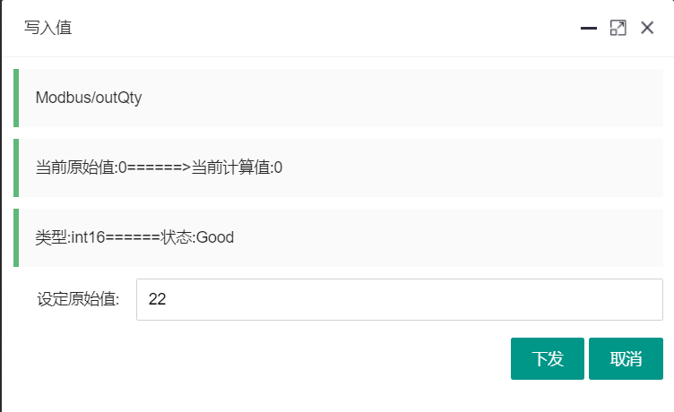
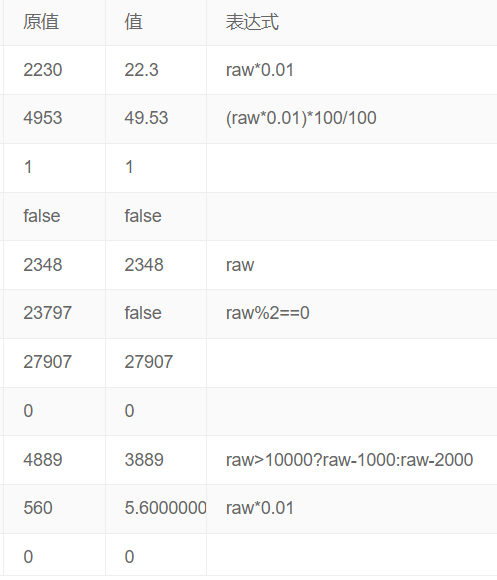
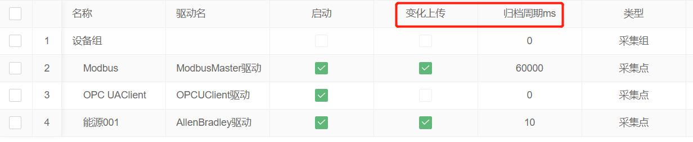
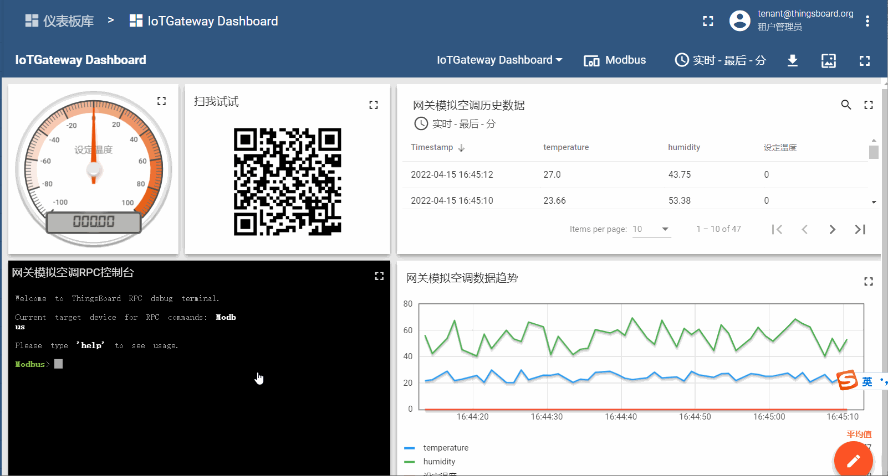
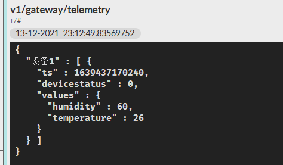
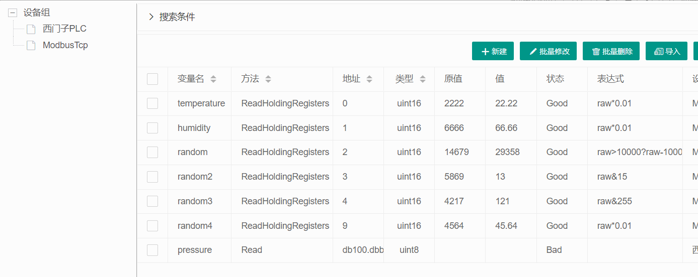
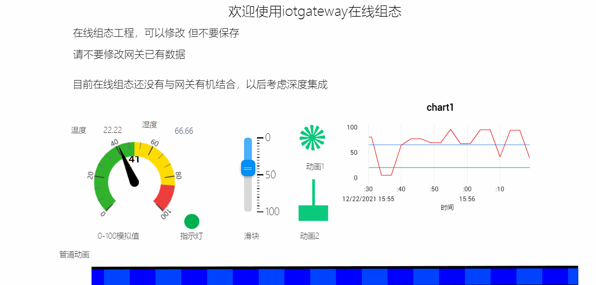
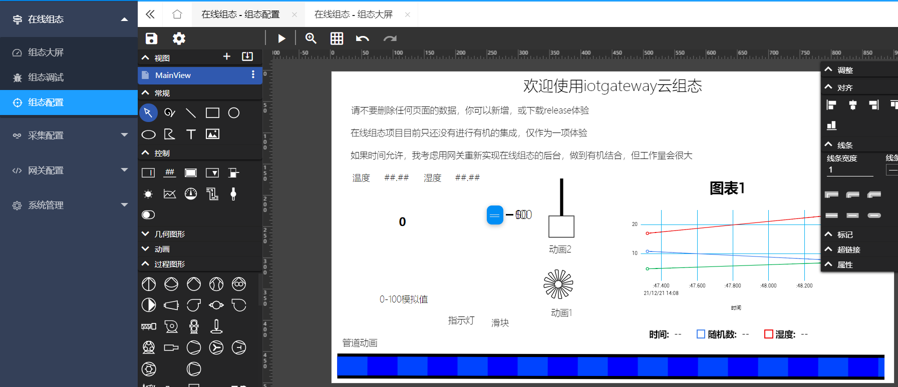

# IoTGateway

## [教程文档:http://iotgateway.net](http://iotgateway.net/)
## [在线体验:http://online.iotgateway.net](http://online.iotgateway.net/)

## [配套硬件产品:http://iotgateway.net/docs/hardware/selection](http://iotgateway.net/docs/hardware/selection/)

## [淘宝店地址:https://iotgateway.taobao.com](https://iotgateway.taobao.com/)


> 基于.NET6的跨平台物联网网关
> 
> B/S架构，可视化配置
> 
> 南向连接到你的任何设备和系统(如PLC、扫码枪、CNC、数据库、串口设备、上位机、OPC Server、OPC UA Server、Mqtt Server等)
> 
> 北向连接Thingsboard、IoTSharp、ThingsCloud、华为云或您自己的物联网平台进行双向数据通讯
> 
> 当然也可以进行边缘计算
>
## 交流

| 微信扫我进群 | 公众号 |    [QQ群:895199932](https://jq.qq.com/?_wv=1027&k=mus0CV0W)  |
| ---- | ------ | ---- |
|  |  |  |

## 重磅推出硬件网关

受益于.netcore**跨平台**能力，此项目并**不限于**下面推荐的硬件设备，你可以在任何主机上运行，但是会针对特定硬件设备做**优化适配**，如

\- **性能监控**：cpu、内存、磁盘等主机指标监控

\- **硬件交互**：模拟量采集、继电器控制等

### 为何推荐

如果你购买了硬件网关：

- **间接为开源项目做贡献**，收益的一部分会投入到开源项目建设中去，包括但不限于云服务器资源租赁、先上线向下活动等
- 可以**免费使用**后续"企业版网关项目(筹)"
- 可以**免费使用**网络透传等服务
- 可使用商业web组态
- 提供详细的**教程文档**，包括**Linux系统**、**dotnet跨平台等**
- 可用于**学习、评估、和生产环境**使用

### 产品列表

- 下列型号均有"**蓝牙BLE 5.0**、**Wi-Fi**"
- 搭载**Linux**操作系统```debian.11```
- 时间关系，目前只整理了 [A080](http://iotgateway.net/docs/hardware/A080/introduction) 、[B100](http://iotgateway.net/docs/hardware/B100/introduction)型号的资料，其他用法差不多，后续会更新
- 23年Q2后会推出**24v**宽电压版本
- 淘宝店是:[https://iotgateway.taobao.com/](https://iotgateway.taobao.com/)

| 型号                                                         | 触摸屏   | USB  | 网口          | 通讯口            | SD扩展 | 4G   | 电源  | RTC  | 典型价格                                                     | 其他接口                                          |
| ------------------------------------------------------------ | -------- | ---- | ------------- | ----------------- | ------ | ---- | ----- | ---- | ------------------------------------------------------------ | ------------------------------------------------- |
| D070                                                         | 无       | 4    | 千兆×1        | 无                | 无     | 无   | 5V    | 无   | 900                                                          |                                                   |
| [A080](http://iotgateway.net/docs/hardware/A080/introduction) | 无       | 2    | 千兆×1        | 232×1;485×4;can×1 | 有     | 可选 | 12V   | 有   | [1200](https://item.taobao.com/item.htm?spm=a1z10.1-c.w4004-13769403149.4.67fb40c29fW8sO&id=679535257919) | 蜂鸣器x1                                          |
| [B100](http://iotgateway.net/docs/hardware/B100/introduction) | 无       | 2    | 百兆×1;千兆×1 | 232×1;485×1       | **无** | 可选 | 12V   | 有   | [1350](https://item.taobao.com/item.htm?spm=a1z10.1-c.w4004-13769403149.2.487440c2LpWLE0&id=679174732349) | ADCx3;DIx2;DIOx1;单刀双置继电器x1;按键x1;蜂鸣器x1 |
| C210                                                         | 10寸电容 | 2    | 千兆×1        | 232×4;485×2       | 有     | 可选 | 6~36V | 有   | 3050                                                         |                                                   |

## 运行

- [直接运行:http://iotgateway.net/docs/iotgateway/run/release-run](http://iotgateway.net/docs/iotgateway/run/release-run)
- [Docker运行:http://iotgateway.net/docs/iotgateway/run/docker-run](http://iotgateway.net/docs/iotgateway/run/docker-run)
- [源码运行:http://iotgateway.net/docs/iotgateway/run/build-run](http://iotgateway.net/docs/iotgateway/run/build-run)

## 南向
- 支持**三菱PLC**、**Modbus**驱动全协议支持、**欧姆龙PLC**、**OPCUA**客户端、**西门子PLC**、**ABPLC**、**MT机床**、**Fanuc CNC**
- 驱动支持二次开发
- [驱动简介](http://iotgateway.net/docs/iotgateway/driver/drvier)
- [驱动二次开发实战之TcpClient](http://iotgateway.net/docs/iotgateway/driver/tcpclient)
- 支持设备数据写入
    
- 支持计算表达式  
  
- 支持变化上传和定时归档
  
  

## 北向
- thingsboard、iotsharp、thingscloud、华为云第三方平台
- 遥测、属性上传
- RPC反向控制
  

## 服务
- 内置Mqtt服务(1888,1888/mqtt),支持websocker-mqtt，直连你的MES、SCADA等
  
- 内置OpcUA(opc.tcp://localhost:62541/Quickstarts/ReferenceServer)，你的设备也可以通过OPCUA和其他设备通信
  
- 内置ModbusSlave(模拟设备)，端口503

## 展示
- Websocker免刷新


- 3D数字孪生Demo
  
  
- 支持接入web组态项目



## 免责声明
- ## 生产环境使用请做好评估
- ## 项目中OPCUA相关功能仅用作学习及测试
- ## 如使用OPCUA协议请联系OPC基金会进行授权，产生一切纠纷与本项目无关

## 友情链接
### IoTClient
开源地址：
https://github.com/zhaopeiym/IoTClient
概述：
这是一个基于.NET Standard 2.0物联网设备通讯协议实现客户端，包括主流PLC、Bacnet等。

## 获得奖项

### .NET20周年云原生开发挑战赛一等奖

### Gitee 2022 GVP

### OSC 2022 最火热中国开源项目社区

## 企业客户(部分)

*国家电网*、*歌尔股份*、*经纬纺机*、*BOSCH*、*荣恒实业*、*卧晨自动化*、*惠斯通*、*......*

## 打赏请留微信或QQ

|  微信 | 支付宝 |
| ----- | ---- |
|  |  |
